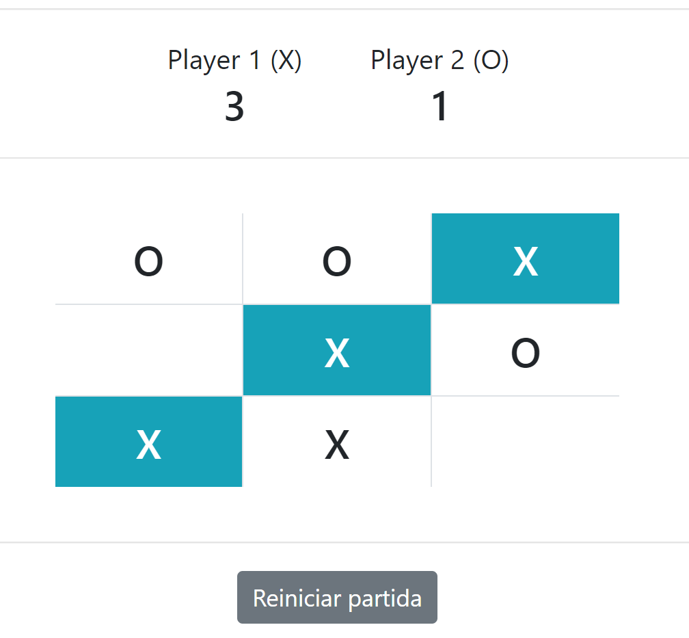

# Tic Tac Toe (Jogo da velha)
Um jogo bem conhecido por todos, onde jogam duas pessoas que em poucos movimentos, precisam completar os quadrantes com o mesmo símbolo em uma das direções para termos um ganhador: vertical, horizontal ou diagonal 

## Como funciona
O desafio vai ser single player, ou seja, você vai jogar contra você mesmo (a não ser que tenha alguém ao seu lado).

> Para ajudar, criei um HTML utilizando bootstrap que tem a estrutura e visual da imagem exibida acima. O arquivo se encontra em [exemplos/index.html](exemplos/index.html)

### Instruções
1) Os quadrantes vão começar vazio e o placar zerado (estado inicial da aplicação)
2) O Player 1 (X) sempre começar
3) Ao clicar em qualquer quadrante, deve preencher com a opção do player atual (X ou O)
4) A cada jogada, troca o player
5) O jogo encerra quando tiver um vencedor ou dar empate
6) Se terminar todos os quadrantes e não houver vencedor, aparecer mensagem de empate em algum lugar por 2 segundos, em seguinte reiniciar a partida sem alterar o placar
7) Se houver vencedor, a sequência (diagonal, vertical ou horizontal) deve ficar com cor de fundo destacada. Esse destaque deve permanecer por 2 segundos e depois reiniciar a partida atualizando o placar
8) O botão 'Reiniciar partida' deve apenas resetar o tabuleiro. O placar continua o mesmo

### Condições para vencer
O Tic Tac Toe (ou jogo da velha) termina quando tem um vencedor ou empate. 

O jogador vence se conseguir preencher uma fileira em sequência na diagonal, horizontal ou vertical com sua opção (X ou O).

Caso não haja vencedores e não há mais quadrantes para serem preenchidos, a partida é encerrada como empate.

## Proposta
Criar todas as funcionalidades listada nas instruções

## Dicas
Este é um desafio que tem bastante 'Entrada de dados', ou seja, muita interação com o usuário para capturar as informações necessárias.

Porém, recebendo essas informações, também temos muito processamento JavaScript, pois a partir da terceira jogada de cada player, precisamos ficar fazendo verificações se há vencedor.

Além disso, precisamos ficar trocando o player atual a cada jogada ;)

E claro, também há saída de dados, pois a cada clique precisamos preencher na tela a jogada do player, e é claro, apresentar o feedback de ganhador ou empate.

Então, tente quebrar em muitas micro tarefas separando por cada camada dessas (entrada, processamento e saída)!